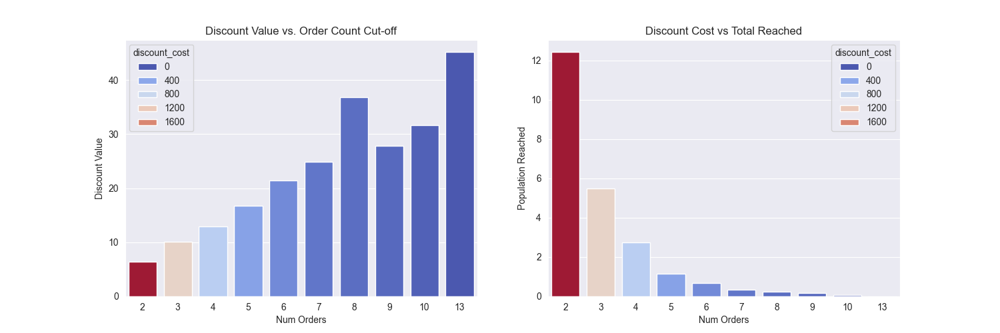

# FoodHub Data Analysis

## Project: Python Foundations – FoodHub

### Dataset Description

The dataset records various attributes of food orders, including customer ratings, preparation and delivery times, and cuisine types.

**Data Dictionary:**

- `order_id`: Unique ID of the order
- `customer_id`: ID of the customer
- `restaurant_name`: Name of the restaurant
- `cuisine_type`: Cuisine ordered
- `cost_of_the_order`: Cost in USD
- `day_of_the_week`: Weekday vs. weekend
- `rating`: Customer rating (out of 5)
- `food_preparation_time`: Time taken by a restaurant (minutes)
- `delivery_time`: Time taken by delivery person (minutes)

---

## Methodology

In this project I analyzed the delivery data from a fake food delivery app called FoodHub and calculated cuisine performance by a restaurant type and rating.

This project was originally part of a UT school project, but the Discount Coast vs. Total Reach section was added more recently.

### Data Cleaning

The input data for this project had over 700 entries without ratings. For this dataset I have populated those table rows with the mean rating for the whole dataset, which is 4.
I also maintained a separate data set with only the entries in the original dataset with rating so that I can check my findings with that dataset if needed.

---

### Main Finding

#### Discount Cost vs. Total Reach

In the original project a 20% discount was proposed for the top 3 customers. I later calculated the business effect of expanding that discount out to more customers using the original data.

In this dataset I create an aggregated dataset by customer_id, and order_id, and calculate the value of the proposed discount for each order cutoff number in or dataset.

**Calculated Fields**

- average_order_cost
- discount_value (by customer and order number)
- maximum_discount_cost (by order cutoff value

**Figure shows discount cost vs total reach along with discount value per customer**

## Recommendations

- Create a discount for customers who make more than 5 orders on the app.

---

### 🏆 Top Restaurants

#### Overall:

| Restaurant                    | Cuisine  | Avg Rating |
| ----------------------------- | -------- | ---------- |
| Sushi of Gari Tribeca         | Japanese | 4.6        |
| Blue Ribbon Sushi Bar & Grill | Japanese | 4.6        |
| Five Guys Burgers and Fries   | American | 4.6        |
| The Meatball Shop             | Italian  | 4.5        |
| Han Dynasty                   | Chinese  | 4.4        |

#### Top by Cuisine:

| Cuisine        | Top Restaurant             | Avg Rating |
| -------------- | -------------------------- | ---------- |
| American       | Five Guys                  | 4.34       |
| Chinese        | Han Dynasty                | 4.28       |
| Indian         | Tamarind TriBeCa           | 4.40       |
| Italian        | The Meatball Shop          | 4.25       |
| Japanese       | Sushi of Gari Tribeca      | 4.37       |
| Mediterranean  | Jack's Wife Freda          | 4.32       |
| Mexican        | Cafe Habana                | 4.23       |
| Middle Eastern | Cafe Mogador               | 4.15       |
| Southern       | Hill Country Fried Chicken | 4.36       |

---

### 🛠️ Tools Used

- Python
- Pandas, NumPy
- Seaborn, Matplotlib
- Jupyter Notebook

---

### 📁 How to Run

1. Clone the repository
2. Open the notebook in Jupyter
3. Run each cell top-to-bottom
4. View the included HTML report for a static overview
